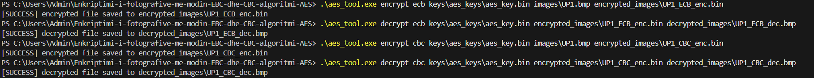

<table>
  <tr>
    <td width="150" align="center" valign="center">
      
    </td>
    <td valign="top">
      <p><strong>University of Prishtina</strong></p>
      <p>Faculty of Computer and Electrical Engineering</p>
      <p>Computer and Software Engineering - Masters Programme </p>
      <p><strong>Course Project:</strong> “Information Security”</p>
      <p><strong>Professor:</strong> Dr. techn. Blerim Rexha , PhD Mërgim Hoti</p>
      <p><strong>Students (Gr. 13):</strong></p>
      <ul>
        <li>Fisnik Hazrolli</li>
        <li>Altin Pajaziti</li>
        <li>Olta Pllana</li>
        <li>Rajmondë Shllaku</li>
      </ul>
    </td>
  </tr>
</table>

---


# Image Encryption using AES Algorithm


This project demonstrates image encryption and decryption using **AES-128** in **ECB** and **CBC** modes.
The tool processes input files (like images) by dividing the data into 16-byte blocks and applying two distinct modes of operation: Electronic Codebook (ECB) and Cipher Block Chaining (CBC).
---

## Folder Structure

```

Enkriptimi-i-fotografive-me-modin-EBC-dhe-CBC-algoritmi-AES/
├─ modules
│  ├─ aes_core.h           # Core AES-128 implementation
│  ├─ aes_core.cpp
│  ├─ ecb_aes.h            # ECB mode wrapper
│  ├─ ecb_aes.cpp
│  ├─ cbc_aes.h            # CBC mode wrapper
│  └─ cbc_aes.cpp  
├─ aes_tool.exe         # Compiled executable
├─ main.cpp             # Main program (optional if using aes_tool.exe)
├─ images/              # Original images
│   └─ UP.png
├─ encrypted_images/    # Encrypted output images
├─ decrypted_images/    # Decrypted output images
├─ keys/                # AES key
│   └─ aes_key/aes_key.bin
└─ viewable_encrypted_images/     # To view the direct comparison between EBC and CBC

```

---

## Files Description

- **aes_core.h / aes_core.cpp**  
<table style="width: 100%; border-collapse: collapse; border: 1px solid #ccc;">
  <thead>
    <tr style="background-color: #f3f4f6;">
      <th>Responsibility</th>
      <th style="padding: 12px; border: 1px solid #ccc; text-align: left;">Purpose</th>
    </tr>
  </thead>
  <tbody>
    <tr>
      <td>Core Functions</td>
      <td style="padding: 12px; border: 1px solid #ccc;">Holds the implementations for <code>encryptBlock</code> and <code>decryptBlock</code>.</td>
    </tr>
    <tr>
      <td style="padding: 12px; border: 1px solid #ccc;">Transformations</td>
      <td style="padding: 12px; border: 1px solid #ccc;">Contains the functions for the four internal AES rounds: **SubBytes**, **ShiftRows**, **MixColumns**, and **AddRoundKey**.</td>
    </tr>
    <tr>
      <td style="padding: 12px; border: 1px solid #ccc;">Key Management</td>
      <td style="padding: 12px; border: 1px solid #ccc;">Implements the **Key Expansion** algorithm, which takes the initial 16-byte key and derives the 11 round keys needed for the 10 encryption rounds.</td>
    </tr>
    <tr>
      <td style="padding: 12px; border: 1px solid #ccc;">Key Takeaway</td>
      <td style="padding: 12px; border: 1px solid #ccc;">This module handles the encryption/decryption of a **single 16-byte block** without any consideration for the blocks before or after it.</td>
    </tr>
  </tbody>
</table>

  Implements AES-128 block cipher core functions:  
  - `encryptBlock` / `decryptBlock`  
  - `subBytes` / `invSubBytes`  
  - `shiftRows` / `invShiftRows`  
  - `mixColumns` / `invMixColumns`  
  - `keyExpansion` and `addRoundKey`  

- **ecb_aes.h / ecb_aes.cpp**  
  AES-128 encryption/decryption in **ECB mode**.  
  Uses PKCS#7 padding for block alignment.
<!-- Table summarizing the responsibilities of the ECB AES Module -->
<table style="width: 100%; border-collapse: collapse; border: 1px solid #ccc; font-family: 'Inter', sans-serif;">
  <thead>
    <tr style="background-color: #f3f4f6;">
      <th style="padding: 12px; border: 1px solid #ccc; text-align: left; width: 30%;">Responsibility</th>
      <th style="padding: 12px; border: 1px solid #ccc; text-align: left;">Purpose</th>
    </tr>
  </thead>
  <tbody>
    <tr>
      <td style="padding: 12px; border: 1px solid #ccc; font-weight: 600;">Block Processing</td>
      <td style="padding: 12px; border: 1px solid #ccc;">Reads the input file block by block (**16 bytes at a time**).</td>
    </tr>
    <tr>
      <td style="padding: 12px; border: 1px solid #ccc; font-weight: 600;">Padding</td>
      <td style="padding: 12px; border: 1px solid #ccc;">Applies **PKCS#7 padding** to the input data if the file size is not an exact multiple of 16 bytes.</td>
    </tr>
    <tr>
      <td style="padding: 12px; border: 1px solid #ccc; font-weight: 600;">Encryption Logic</td>
      <td style="padding: 12px; border: 1px solid #ccc;">Calls the `aes_core` functions to encrypt each block **independently**.</td>
    </tr>
    <tr>
      <td style="padding: 12px; border: 1px solid #ccc; font-weight: 600;">Decryption Logic</td>
      <td style="padding: 12px; border: 1px solid #ccc;">Reads blocks, decrypts them using `aes_core`, and securely handles the **removal of PKCS#7 padding** at the end.</td>
    </tr>
  </tbody>
</table>

- **cbc_aes.h / cbc_aes.cpp**  
  AES-128 encryption/decryption in **CBC mode**.  
  Uses a fixed 16-byte IV for the first block. Subsequent blocks XOR with previous ciphertext.

  <!-- Table summarizing the responsibilities of the CBC AES Module -->
<table style="width: 100%; border-collapse: collapse; border: 1px solid #ccc; font-family: 'Inter', sans-serif;">
  <thead>
    <tr style="background-color: #f3f4f6;">
      <th style="padding: 12px; border: 1px solid #ccc; text-align: left; width: 30%;">Responsibility</th>
      <th style="padding: 12px; border: 1px solid #ccc; text-align: left;">Purpose</th>
    </tr>
  </thead>
  <tbody>
    <tr>
      <td style="padding: 12px; border: 1px solid #ccc; font-weight: 600;">Initialization Vector (IV)</td>
      <td style="padding: 12px; border: 1px solid #ccc;">Generates a **unique, random 16-byte IV** for every encryption run. This IV is used to start the chaining and is written to a separate file for decryption (as seen in `main.cpp`).</td>
    </tr>
    <tr>
      <td style="padding: 12px; border: 1px solid #ccc; font-weight: 600;">Chaining Logic</td>
      <td style="padding: 12px; border: 1px solid #ccc;">Before encrypting the current plaintext block, it performs an **XOR** operation with the previous block's ciphertext (or the IV for the first block).</td>
    </tr>
    <tr>
      <td style="padding: 12px; border: 1px solid #ccc; font-weight: 600;">Security Improvement</td>
      <td style="padding: 12px; border: 1px solid #ccc;">Ensures that identical plaintext blocks result in unique ciphertext blocks, effectively **preventing the pattern leakage** that is the major vulnerability of ECB mode.</td>
    </tr>
    <tr>
      <td style="padding: 12px; border: 1px solid #ccc; font-weight: 600;">Core Usage</td>
      <td style="padding: 12px; border: 1px solid #ccc;">Like ECB, it utilizes the `aes_core` functions to perform the raw **block encryption/decryption** after the critical XOR step is complete.</td>
    </tr>
  </tbody>
</table>

- **aes_tool.exe / main.cpp**
Command-line tool for encrypting/decrypting images 

**How it works**: All your source C++ code is converted into machine code and packaged into aes_tool.exe
  
```

aes_tool.exe <encrypt|decrypt> <ecb|cbc> <key_file> <input_file> <output_file>

````
<table style="width: 100%; border-collapse: collapse; border:  font-family: 'Inter', sans-serif;">
  <thead>
    <tr style="background-color: #f3f4f6;">
      <th style="padding: 12px; border: 1px solid #ccc; text-align: left; width: 30%;">Responsibility</th>
      <th style="padding: 12px; border: 1px solid #ccc; text-align: left;">Purpose</th>
    </tr>
  </thead>
  <tbody>
    <tr>
      <td style="padding: 12px; border: 1px solid #ccc; font-weight: 600;">Argument Parsing</td>
      <td style="padding: 12px; border: 1px solid #ccc;">Reads and validates the five command-line arguments: **Action** (`encrypt`/`decrypt`), **Mode** (`ecb`/`cbc`), **Key File**, **Input File**, and **Output File**.</td>
    </tr>
    <tr>
      <td style="padding: 12px; border: 1px solid #ccc; font-weight: 600;">File Handling</td>
      <td style="padding: 12px; border: 1px solid #ccc;">Manages the reading of the key file, input data, and writing of the final output (ciphertext or decrypted plaintext).</td>
    </tr>
    <tr>
      <td style="padding: 12px; border: 1px solid #ccc; font-weight: 600;">CBC IV Management</td>
      <td style="padding: 12px; border: 1px solid #ccc;">**Crucially, in CBC mode**, this module is responsible for **generating a random IV** during encryption and **reading the corresponding IV** file during decryption.</td>
    </tr>
    <tr>
      <td style="padding: 12px; border: 1px solid #ccc; font-weight: 600;">Delegation</td>
      <td style="padding: 12px; border: 1px solid #ccc;">Based on the user's chosen mode (`ecb` or `cbc`), it correctly routes the input data and key to the relevant encryption/decryption function (`encryptECB` or `encryptCBC`, etc.).</td>
    </tr>
    <tr>
      <td style="padding: 12px; border: 1px solid #ccc; font-weight: 600;">Error Reporting</td>
      <td style="padding: 12px; border: 1px solid #ccc;">Catches and reports high-level errors to the user via the console, such as "Incorrect number of arguments" or "File not found."</td>
    </tr>
  </tbody>
</table>
---

# Encryption Rundown

### 1.  Create executable file 
Create executable file containing all source code:
```powershell
g++ modules/main.cpp modules/aes_core.cpp modules/ecb_aes.cpp modules/cbc_aes.cpp -o aes_tool.exe
```


### 2. Key Generation

Create a random 16-byte AES key using PowerShell:

```powershell
# Ensure keys folder exists
mkdir keys -Force

# Generate 16-byte key
$bytes = New-Object byte[] 16
[System.Security.Cryptography.RandomNumberGenerator]::Create().GetBytes($bytes)
[System.IO.File]::WriteAllBytes("keys\aes_keys\aes_key.bin", $bytes)
````


---

### 3. Encryption and Decryption commands

For a practical and relatable demonstration of the AES modes of operation, we will use our university's logo as the primary example image. Encrypting the logo allows for a direct, visual comparison of the ECB (Electronic Codebook) and CBC (Cipher Block Chaining) modes. 

By observing the distinct corruption patterns in the resulting encrypted files, we can clearly demonstrate the catastrophic security flaw of ECB's deterministic nature versus the superior randomization provided by CBC. 

This concrete example illustrates why CBC is the standard choice for secure data transmission.


**Encrypt using ECB:**

```powershell

.\aes_tool.exe encrypt ecb keys\aes_keys\aes_key.bin images\UP1.bmp encrypted_images\UP1_ECB_enc.bin
```
**Result**: The encrypted file is saved in the /encrypted_images/UP1_ECB_enc.bin

**Decrypt using ECB:**

```powershell
.\aes_tool.exe decrypt ecb keys\aes_keys\aes_key.bin encrypted_images\UP1_ECB_enc.bin decrypted_images\UP1_ECB_dec.bmp
```
**Result**: The decrypted file is saved in the /decrypted_images/UP1_EBC_dec.bmp

**Encrypt using CBC:**

```powershell
.\aes_tool.exe encrypt cbc keys\aes_keys\aes_key.bin images\UP1.bmp encrypted_images\UP1_CBC_enc.bin
```
**Result**: The encrypted file is saved in the /encrypted_images/UP1_CBC_enc.bin
**Decrypt using CBC:**

```powershell
.\aes_tool.exe decrypt cbc keys\aes_keys\aes_key.bin encrypted_images\UP1_CBC_enc.bin decrypted_images\UP1_CBC_dec.bmp
```
**Result**: The decrypted file is saved in the /decrypted_images/UP1_CBC_dec.bmp

Powershell Command:



## Mode of Operation Comparison (EBC vs CBC) 
**EXPECTED OUTPUT ANALYSIS:**
* This tool supports two fundamental modes of AES operation: Electronic Codebook (ECB) and Cipher Block Chaining (CBC). The security demonstration uses a simple visualization trick: applying the original image header to the raw encrypted binary data. 
* ECB mode exhibits a critical security weakness; as shown in the output, it preserves the structural patterns and outlines of the original image because identical plaintext blocks encrypt to identical ciphertext blocks. 
* In contrast, CBC mode properly chains the encryption process, ensuring the output is truly randomized. When attempting to visualize the CBC encrypted file, the resulting data is so thoroughly obscured that image viewers typically fail to load the file, confirming that all correlation and patterns from the original image have been effectively destroyed. 

**As a result**: We strongly recommend using CBC for all encryption tasks to ensure maximum confidentiality.

---
**EBC VIEWABLE IMAGE:**


```powershell
#Command to view EBC encrypted image
$HeaderSize = 54

$OriginalFile = "images\UP1.bmp"
$EncryptedFile = "encrypted_images\UP1_ECB_enc.bin"
$OutputVisual = "viewable_encrypted_images\UP1_ECB_Visual.bmp"

Get-Content -Path $OriginalFile -Encoding Byte -TotalCount $HeaderSize | Set-Content $OutputVisual -Encoding Byte
Get-Content -Path $EncryptedFile -Encoding Byte | Add-Content $OutputVisual -Encoding Byte
```


**CBC VIEWABLE IMAGE:**
```powershell
#Command to view EBC encrypted image

$EncryptedFile = "encrypted_images\UP1_CBC_enc.bin"
$OutputVisual = "viewable_encrypted_images\UP1_CBC_Visual.bmp"

Get-Content -Path $OriginalFile -Encoding Byte -TotalCount $HeaderSize | Set-Content $OutputVisual -Encoding Byte
Get-Content -Path $EncryptedFile -Encoding Byte | Add-Content $OutputVisual -Encoding Byte

```


> Notes:
>
> * BMP/PNG headers are preserved.
> * Padding is applied only during encryption, removed on decryption if required (for non-BMP images).
> * The C++ tool automatically generates a unique, random IV for every CBC encryption and includes it at the start of the encrypted file.

---

## Implementation Notes

* **AESCore**: 
Implements AES-128 block cipher functions: encryptBlock, decryptBlock
Sub-functions: subBytes / invSubBytes, shiftRows / invShiftRows, mixColumns / invMixColumns
Key expansion (keyExpansion) and round key addition (addRoundKey)
Works on 16-byte blocks
* **ECB Mode**: 
Each 16-byte block is encrypted independently
Uses PKCS#7 padding to ensure full blocks
Simpler but less secure for images (pattern leakage)
* **CBC Mode**: 
Each block XORed with the previous ciphertext block
Generates a random 16-byte IV for each encryption and prepends it to the output file.
Safer for images; preserves confidentiality of repeating patterns
* **Padding**: 
PKCS#7 ensures input is multiple of 16 bytes.

---

## Troubleshooting

1. **Key file not found**
   Make sure `keys\aes_keys\aes_key.bin` exists. Generate it if missing (see Key Generation).

2. **PowerShell “command not recognized”**
   Use `.\aes_tool.exe` in the current directory.

3. **PNG vs BMP**
   For BMP, headers (54 bytes) are preserved; do not remove padding.
   For PNG, padding can be removed after decryption.

---

## References

* AES standard (FIPS-197)
* ECB & CBC modes explanation
* PKCS#7 padding specification

